# Archi Plugin Tutorial - coArchi1

- [Archi Plugin Tutorial - coArchi1](#archi-plugin-tutorial---coarchi1)
  - [Contents](#contents)
  - [0. Introduction](#0-introduction)
    - [0.1 Opening and Introduction](#01-opening-and-introduction)
    - [0.2 Setup Archi Test Environments](#02-setup-archi-test-environments)
  - [1. coArchi1 Setup and Configuration](#1-coarchi1-setup-and-configuration)
    - [1.1 coArchi1 Setup](#11-coarchi1-setup)
    - [1.2 coArchi1 Configuration](#12-coarchi1-configuration)
  - [2. coArchi1 Basics](#2-coarchi1-basics)
    - [2.1 How it Works?](#21-how-it-works)
    - [2.2 Key User Interface Elements](#22-key-user-interface-elements)
    - [2.3 Quick Start](#23-quick-start)
  - [3. Manage Workspace](#3-manage-workspace)
    - [3.1 Add Local Model to Workspace](#31-add-local-model-to-workspace)
    - [3.2 Import a Model (from Remote Workspace)](#32-import-a-model-from-remote-workspace)
    - [3.3 Delete a Model from Local Workspace](#33-delete-a-model-from-local-workspace)
  - [4. Manage Changes](#4-manage-changes)
    - [4.1 Commit or Undo Your Changes](#41-commit-or-undo-your-changes)
      - [4.1.1 Save Changes](#411-save-changes)
      - [4.1.2 Commit Changes](#412-commit-changes)
      - [4.1.3 Abort Uncommitted Changes](#413-abort-uncommitted-changes)
    - [4.2 Refresh and Publish](#42-refresh-and-publish)
      - [4.2.1 Refresh a Model](#421-refresh-a-model)
        - [4.2.1.1 Refresh `not authorized` Error](#4211-refresh-not-authorized-error)
      - [4.2.2 Publish a Model](#422-publish-a-model)
    - [4.3 Change History - `The Time Machine`](#43-change-history---the-time-machine)
    - [4.4 Solve Conflicts](#44-solve-conflicts)
  - [5. Manage Branches](#5-manage-branches)
    - [5.1 Create and Delete Branches](#51-create-and-delete-branches)
    - [5.2 Merge Branches](#52-merge-branches)
    - [5.3 Handling Branches in the Team](#53-handling-branches-in-the-team)
  - [6. Connection, Authentication \& Security](#6-connection-authentication--security)
  - [7. Do's \& Don't and Other Known Issues](#7-dos--dont-and-other-known-issues)

## Contents

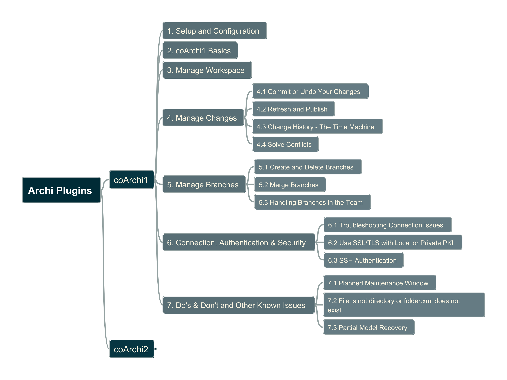</img>

## 0. Introduction

### 0.1 Opening and Introduction

Why this tutorial?

- Since Archi itself is one standalone client tool for ArchiMate modeling, if you're working in the architect team on the common Archi model, the coArchi is the must adopted collaboration plug-in.
- I (and our architect team) have used coArchi since 2021, keep evolving the way of working to handling our Archi repository (12K+ Elements, 14K+ Properties and 35K+ Relationships)
- Share our practices to the community to help making Archi better

Why coArchi1 tutorial still?

- coArchi1 (v0.9.5 as of 2026/02/28) is provided from the Archi development team and keep evolving, you may find coArchi2 is on the way which bring more feature and better performance.
- however, since coArchi2 have the big changes and not compatible with coArchi1, you may still keep in coArchi1 for certain reason, thus, know how coArchi1 in detail still valuable as the foundation

How's the tutorial structured and where are the resources?

- This repo stores the hands-on README as the central information
- Practice Archi models are kept in dedicate "[Enterprise Architecture Playground](https://github.com/EA-PlayGround)" in Github for remote model demo
- Mindmap file (using FreePlane tool) shows the table of contents
- Check [wiki page](https://github.com/archimatetool/archi-modelrepository-plugin/wiki) to learn the words from Archi project. Below are based on the wiki structure with adding more practical reference.
- Tutorial videos will be packaged to [Udemy](https://www.udemy.com/user/xiaoqi-zhao/) and also shared in [YouTube](http://www.youtube.com/@yasenzhao) (stay tunes)

### 0.2 Setup Archi Test Environments

To simulate and demo collaboration within one team, using Archi zip package to install two parallel instances, configure the `Archi.ini` to point to its specific path so that their programs are not conflicted and you may open them at the same time.

Archi version: 5.7.0

Default `Archi.ini` content:

```conf
-startup
plugins/org.eclipse.equinox.launcher_1.6.800.v20240513-1750.jar
--launcher.library
plugins/org.eclipse.equinox.launcher.win32.win32.x86_64_1.2.1000.v20240507-1834
-cleanConfig
--launcher.defaultAction
openFile
-eclipse.keyring
@user.home/AppData/Roaming/Archi/secure_storage
-vmargs
-Dosgi.requiredJavaVersion=21
-Dfile.encoding=UTF-8
-Declipse.p2.data.area=@config.dir/p2
-Ddata.location=@user.home/Documents/Archi
-Dslf4j.internal.verbosity=ERROR
--add-modules=ALL-SYSTEM
-Dosgi.instance.area=@user.home/AppData/Roaming/Archi
-Dosgi.configuration.area=@user.home/AppData/Roaming/Archi/config
-Dorg.eclipse.equinox.p2.reconciler.dropins.directory=%user.home%/AppData/Roaming/Archi/dropins
```

## 1. coArchi1 Setup and Configuration

### 1.1 coArchi1 Setup

Download and Installation Steps:
1. Download the coArchi1 (in .archiplugin extension) from Archi plug-in page https://www.archimatetool.com/plugins/
2. In Archi, select "Manage Plug-in..." from the main Help menu. From the Plug-ins Manager window, select "Install New..." and select the plug-in file and then, when prompted, allow Archi to restart
   
- 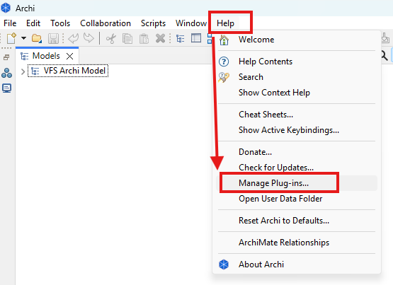
  
3. The "Collaboration" menu should now be visible
   
- 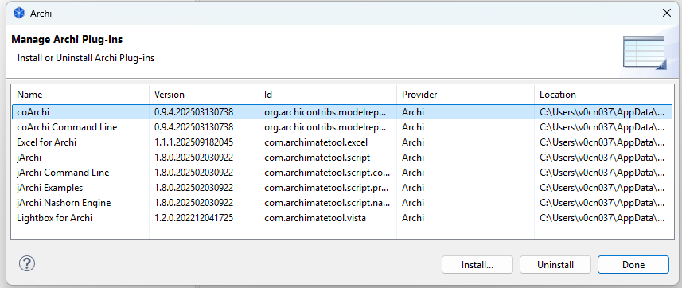

### 1.2 coArchi1 Configuration

From Archi menu [Edit]>[Preferences], click "Collaboration" tab as below:

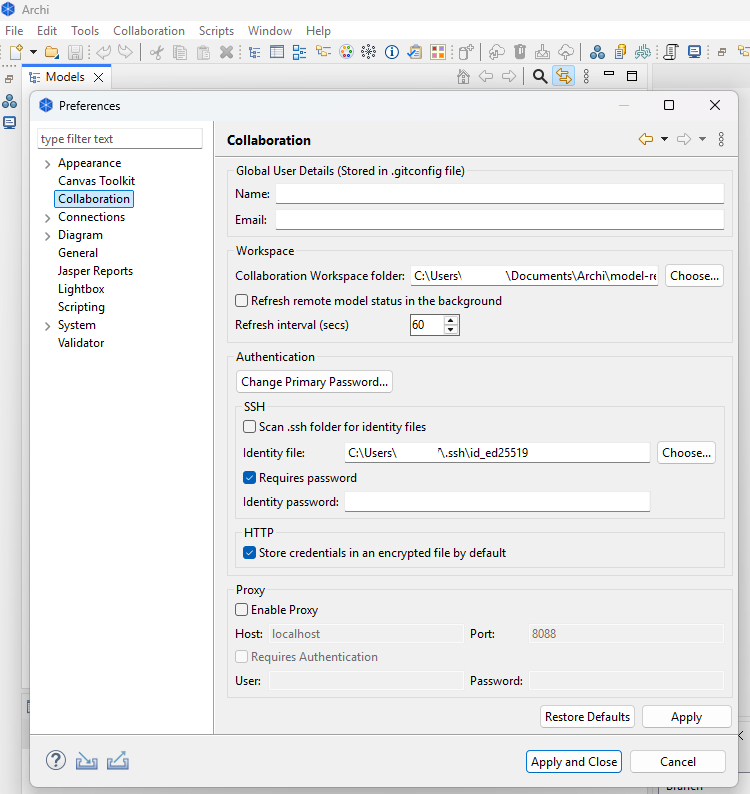

| Setting Item Group | Explanation |
| --- | --- |
| Global User Details | - Stored in `.gitconfig` file<br>- Every commit is signed with these identity, comprising by `Name` and `Email`<br>- NOTE: you cannot change the signature of a commit after committing! |
| Workspace | - The `Collaboration Workspace folder` is by default located in Archi's home folder. This folder contains local copies of all the models that you have in your workspace. In some aspects, it **is** your workspace.<br>- You can change this location if required.<br>- If you want the models to update their status in the background, check the setting here. `Background fetch` allos Archi to automatically get remote updates to update a model's status base on the `Refresh interval` setting. Note: this does NOT actually refresh the model but only the status. |
| Authentication | - For all actions a `Primary Password` is required. You can set or change this password here.<br>- The `primary password` secures an encryption key that is used to encrypt all other passwords (passwords for each repository), the password that secures the SSH identity (if used) and the password that secures the Proxy settings (if used).<br>- `SSH`: if using SSH repositories set the path to the identity file and password here. If using more than one SSH key select the option to scan the `~/.ssh` folder for SSH keys, this allows more than one SSH key for different remote hosts. NOTT that the identity password must be the same for all key files. Reference: [SSH Authentication section](https://github.com/archimatetool/archi-modelrepository-plugin/wiki/SSH-Authentication)<br>- `HTTP`: If not enabled you will be prompted for your credentials each time you have to connect to a server (i.e. when refreshing or publishing a model). You can enable (by default) this option if you want a seamless experience. |
| Proxy | - If the models you work with are stored on a server which is behind a web proxy, you can configure that here.<br>NOTE: if proxy support is enable - by default not- it will be used to connect to all of your models. |

## 2. coArchi1 Basics

### 2.1 How it Works?

Archi tool itself used to be a single user solution with no collaboration feature. This had been changed with the creation, some years ago, of the model repository plugin, usually known as the collaboration plugin (or in short name now - coArchi).

The plugin follow the `KISS - Keep It Stupid Simple` principle: instead of reinventing the wheel and implementing the whole set of collaboration features, it uses `Git` (a source code management system) to manage the hard stuff (branch management, diff/merge...). But the plugin manages all the "plumbing" needed to provide a good user experience without requiring `Git` knowledge.

Note: While, I suggest you learn some foundation concepts of `Git` still, which will benefit you to understand the way of handling coArchi branches!

From a technical point of view, a model repository is nothing more than a `Git` server (or project concept in GitHub) into which you'll have one git repository per model. Each of those repositories (that you'll have to create by yourself) will contain a single ArchiMate model stored in a set of XML files. Each file contains the descriptionb of a single object (element, relationship or view).

Practice: In this course, we will create one model called `coArchi1Test`, and push it as repository in GitHub.

> [!IMPORTANT]
> - ALWAYS handle `commit` and `merge` and other activities within coArchi plugin.
> - You should NOT use `merge`, `pull requests` or similar features from your Git server as this would certainly lead to model corruption!
> - Though based on Git, the collaboration plugin adds anti-corruption actions while performing these operations.

If you are interested by the underlying logic, note that the coArchi1 is built upon adrealy existing Grafico plugin (https://github.com/archi-contribs/archi-grafico-plugin), so reading Grafico wiki (https://github.com/archi-contribs/archi-grafico-plugin/wiki) can helps understanding how all this can work.

### 2.2 Key User Interface Elements

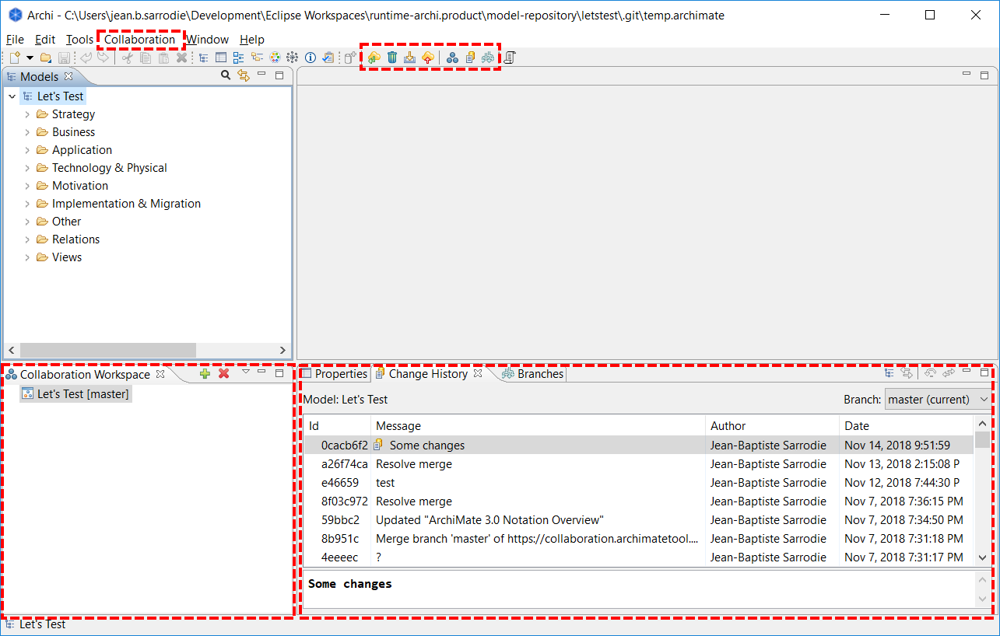

- Collaboration Workspace:
  - allow quick access to all ArchiMate models managed by this plugin. Model icon change depending on sync state.
  - This state is also visible in the status bar when a model is selected.
- Change history tab:
  - show the list of commits done on selected model.
  - Also allows access to old versions (`Extract model from this commit`) and rolling back changes (`Restore to this commit` and `Undo the latest commit`)
- Collaboration menu:
  - 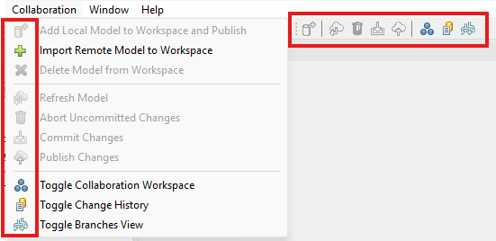
  - offers access to all features.
  - They apply to the currently active model (i.e. the model owning the view being edited and in focus, or the one that contains the select element in the model tree)
- Toolbar:
  - offers quick access to main features
  - Also apply to the currently active model

### 2.3 Quick Start

1. You need to have a new empty git repository already setup on a git server
2. Ensure the default branch on the git server is named "master" ("main" will be supported in a future version)
   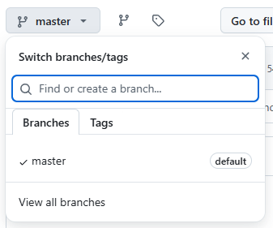
3. > [!Note] some Git hosting sites, such as GitHub and BitBucket, require the use of a Personal Access Token for the password if using a HTTPS connection. See https://docs.github.com/en/authentication/keeping-your-account-and-data-secure/creating-a-personal-access-token
4. To add the model from the repository locally, select the first toolbar button in the plugin tab (the green cross). This will clone the repository and create a new blank model
   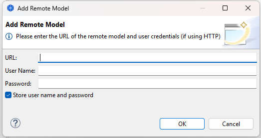
   - URL: Git Repository link, here we use https://github.com/EA-PlayGround/coArchi1QuickStart for demo in the courese
   - User Name: GitHub account name
   - Password: since I'm having MFA setting in GitHub, cannot use single password here, need to generate the PAT (step 3) and put the token value here
5. Work as usual on your model and save it whenever you want
   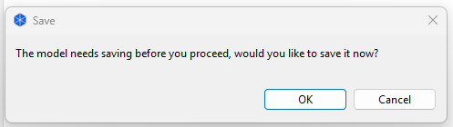
6. When you're ready to commit your changes, then choose "Commit Changes" (this can be done offline)
   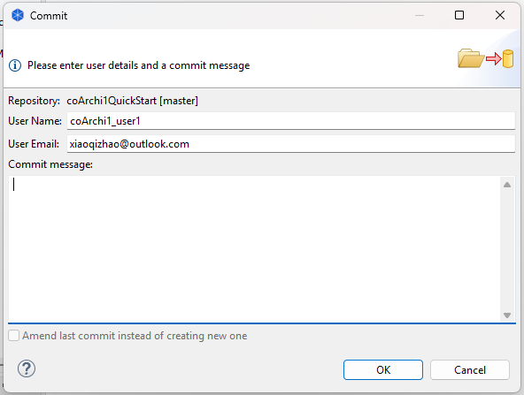
7. When you're ready to publish/share your work, then choose "Publish". In case of conflicts (same concept changed and published by someone else) you'll see a windows helping you to fix them.
   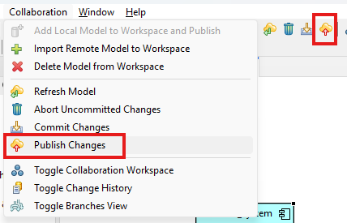

## 3. Manage Workspace

### 3.1 Add Local Model to Workspace

> [!NOTE] Within this tutorial, we'll refer to `ArchiSurance` case study as model content reference.

Steps to enable collaboration work on an existing or newly created model are:

1. Create a new Git repository on your Git server (either cloud or on-premise soluiton like GitHub, GitLab, Azure DevOpe, BitBucket, Gitee...)
2. Open (or create) your model in Archi
3. Select the "Collaboration > Add local model to workspace and publish" menu option
   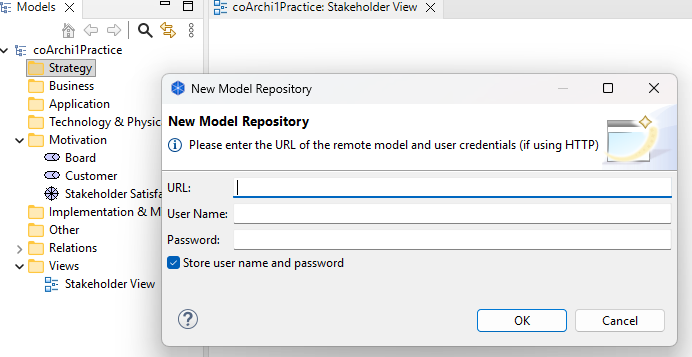
4. In the dialog that will appear, enter the URL of the newly created Git repository and your credentials on the Git server of your choice.
5. The model will be added to the Collaboration Workspace and published on the Git server

> [!NOTE] The URL of the Git repository usually ends with `.git`!

You can compare the standalone model (`.archimate`) with the model after published to the Git server.

### 3.2 Import a Model (from Remote Workspace)

Once a model has been switched to collaborative mode and published on the server, it can be imported by another user, with following steps:

1. Select the "Collaboration > Import Remote Model to Workspace" menu option
2. In the dialog box that will appear, enter the Git repository's URL and your credentials on the Git server
   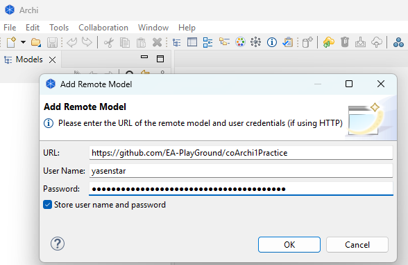
3. The model will be added to the Collaboration Workspace

### 3.3 Delete a Model from Local Workspace

When you no longer wish to work on a model, you can remove it from your workspace through the "Collaboration > Delete Model from Workspace" menu action.

You will then be prompted to confirm.

> [!NOTE] This action only deletes your local copy. The remote model stored on the Git server will not be impacted.

## 4. Manage Changes

### 4.1 Commit or Undo Your Changes

#### 4.1.1 Save Changes

This action is the usual "Save" provided by Archi. Changes are saved but no commits are created

#### 4.1.2 Commit Changes

This action locally backs up the changes without publishing them. You will have to enter a message describing the changes.

#### 4.1.3 Abort Uncommitted Changes

This action allows you to `undo` any locally made but uncommitted changes.

### 4.2 Refresh and Publish

#### 4.2.1 Refresh a Model

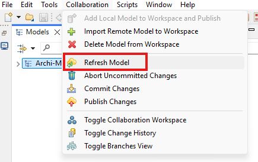

This action updates the local copy of a model by importing and merging all changes that have been published to the remote model by other users.

If you have uncommitted changes in your local model (even if they are not in conflict with other changes to the repository), coArchi will require you to commit them as you do a refresh.

##### 4.2.1.1 Refresh `not authorized` Error

When using HTTPS via GitHub with 2-factor authentication (2FA), if you areabel to import and refresh your model but see the following message on publish:

`There was an error: <repo URL>: not authorized`

[Create a Personal Access Token (PAT)](https://help.github.com/en/github/authenticating-to-github/creating-a-personal-access-token-for-the-command-line) and use it in place of your normal GitHub password.

#### 4.2.2 Publish a Model

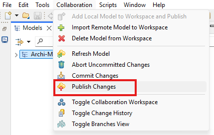

This action allows you to share your changes with your colleagues by saving them to the (remote) model repository.

If needed, a resolution of conflicts will be triggered.

Technically, the publication corresponds to a `git pull` followed by a `git push`.

### 4.3 Change History - `The Time Machine`

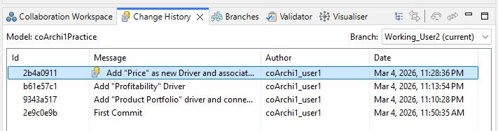

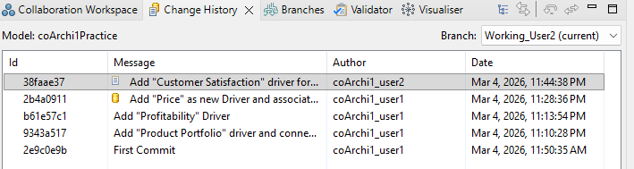

### 4.4 Solve Conflicts

Typical situations for getting conflicts are listed below and you may see in the demo:

Scenario 1: Elements are changed concurrently in same view

1. Both user1 and user2 are working on the same view and commit/publish
2. They may place one common element in the different position of the view
3. User1 merges the change to "master" first
4. Then when User2 want to merge from "master", conflict need to be solved

Scenario 2: Element is being used newly but deleted by another user

1. User1 use one repository existing element to a new view, and other normal modeling work (e.g. adding relationships)
2. User2 delete that exact element from model
3. One user merges the change to "master" first
4. Then when User2 want to merge from "master", conflict need to be solved

## 5. Manage Branches

### 5.1 Create and Delete Branches

### 5.2 Merge Branches

### 5.3 Handling Branches in the Team

Below steps are the reference "bible" for our modeler team to collaborate using coArchi1 on the common model:

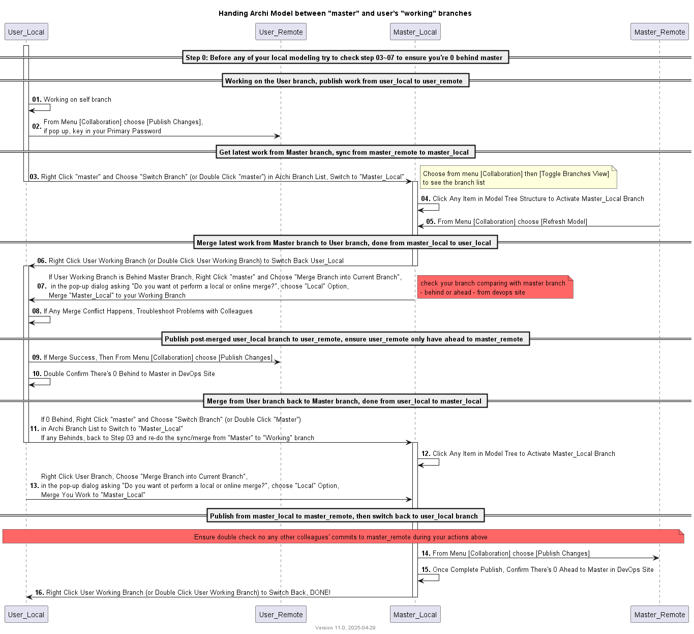

## 6. Connection, Authentication & Security

## 7. Do's & Don't and Other Known Issues

---

Last updated at 2026-03-01