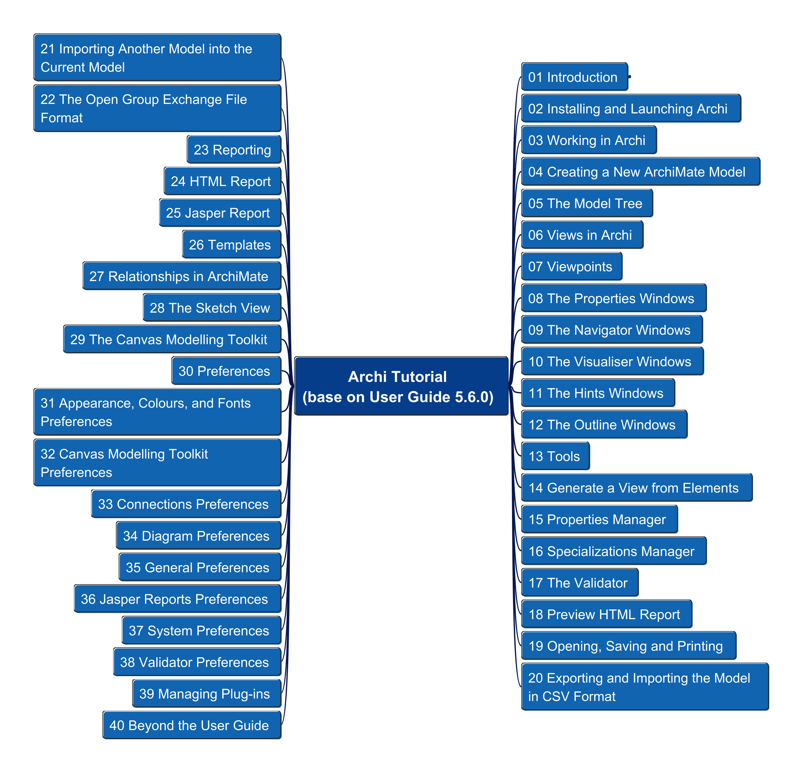

# Archi_Tutorial

This is the repository to document hands-on demos for Archi (ArchiMate Modeling) tool base on "Archi User Guide"

- [Archi\_Tutorial](#archi_tutorial)
  - [Structure of the User Guide Content](#structure-of-the-user-guide-content)

## Structure of the User Guide Content

---

Any questions are welcome to reach me at [My Email](mailto:xiaoqizhao@outlook.com?subject=Archi%20Tool%20Tutorial&body=I%20have%20question.)