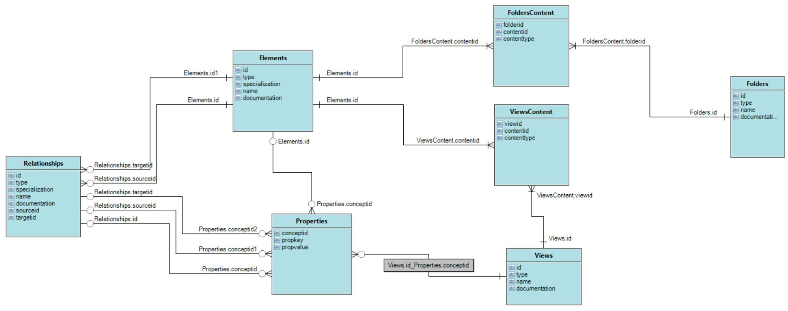

# Archi Tutorial base on User Guide 5.6.0

This is the repository to document hands-on demos for Archi (ArchiMate Modeling) tool base on "Archi User Guide"

- [Archi Tutorial base on User Guide 5.6.0](#archi-tutorial-base-on-user-guide-560)
  - [Structure of the User Guide Content](#structure-of-the-user-guide-content)
  - [Direct Links for Key Archi Resources](#direct-links-for-key-archi-resources)
  - [Video Lists for Demostration the User Guide](#video-lists-for-demostration-the-user-guide)
  - [Understand Archi Model's E-R](#understand-archi-models-e-r)

## Structure of the User Guide Content

## Direct Links for Key Archi Resources

- [Archi Tool Website](https://www.archimatetool.com/)
- [Archi User Guide (5.6.0)](https://www.archimatetool.com/downloads/archi/Archi%20User%20Guide.pdf)
- [Archi Tool Forum](https://forum.archimatetool.com)
- [Archi Project in Github](https://github.com/archimatetool/archi)

## Video Lists for Demostration the User Guide

- [Archi Modeling Tutorial base on User Guide 5.6.0 @ YouTube](https://www.youtube.com/playlist?list=PL6DEHvciXKeXrv1A4AV2wy1RDv-Y5MRip)

## Understand Archi Model's E-R

Once exporting Archi model to HTML report, understanding below E-R diagram will benefit you to query needed information:

---

Any questions are welcome to reach me at [My Email](mailto:xiaoqizhao@outlook.com?subject=Archi%20Tool%20Tutorial&body=I%20have%20question.)