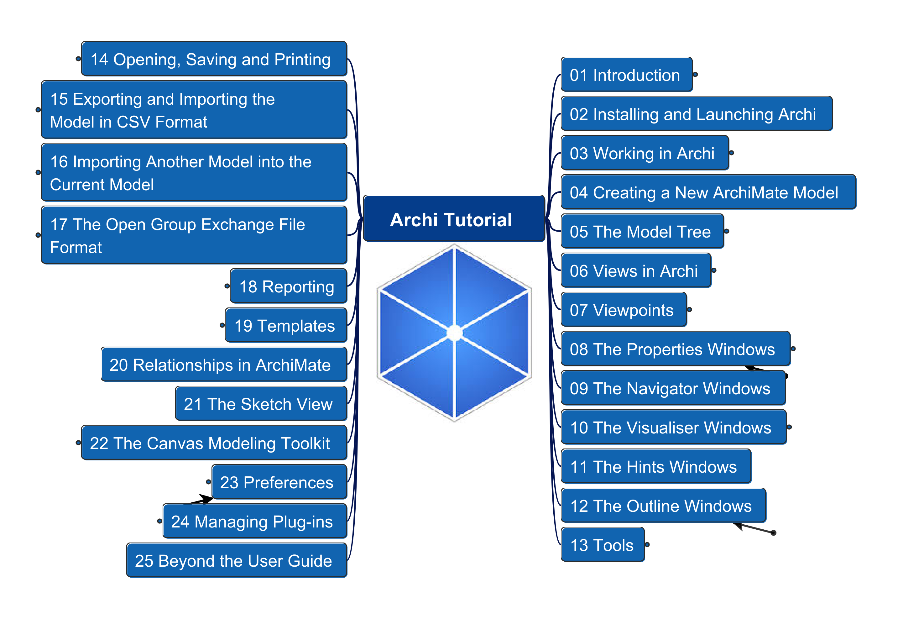
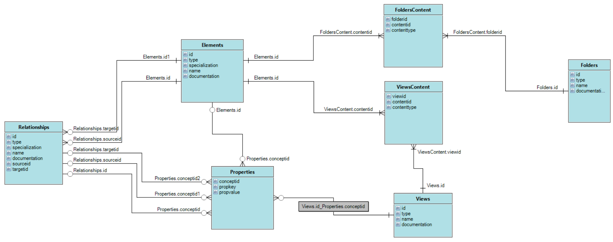

# Archi Tutorial base on User Guide (updated to 5.8.0)

This is the repository to document hands-on demos for Archi (ArchiMate Modeling) tool base on "Archi User Guide"

- [Archi Tutorial base on User Guide (updated to 5.8.0)](#archi-tutorial-base-on-user-guide-updated-to-580)
  - [Structure of the User Guide Content](#structure-of-the-user-guide-content)
  - [Direct Links for Key Archi Resources](#direct-links-for-key-archi-resources)
  - [Packaged Course in Udemy](#packaged-course-in-udemy)
  - [Video Lists for Demostration the User Guide](#video-lists-for-demostration-the-user-guide)
  - [Repositories on Learning Archi User Guide](#repositories-on-learning-archi-user-guide)
  - [Understand Archi Model's E-R](#understand-archi-models-e-r)

## Structure of the User Guide Content

## Direct Links for Key Archi Resources

- [Archi Tool Website](https://www.archimatetool.com/)
- Archi User Guides:
  - [User Guide 5.8.0](docs/Archi%20User%20Guide-5.8.0-20260218.pdf)
  - [User Guide 5.7.0](docs/Archi%20User%20Guide-5.7.0-20250923.pdf)
  - [User Guide 5.6.0](docs/Archi%20User%20Guide-5.6.0-20250512.pdf)
- [Archi Tool Forum](https://forum.archimatetool.com)
- [Archi Project in Github](https://github.com/archimatetool/archi)

## Packaged Course in Udemy

Click below image to enroll the full well packaged course in Udemy, and support me to keep updating the contents:

## Video Lists for Demostration the User Guide

- [Archi Modeling Tutorial base on User Guide @ YouTube](https://www.youtube.com/playlist?list=PL6DEHvciXKeXrv1A4AV2wy1RDv-Y5MRip)
- [抖音 DouYin: Archi User Guide](https://www.douyin.com/collection/7546620525087295530)
- [B站 BiliBili.com - Archi User Guide](https://space.bilibili.com/158390142/lists/6324904?type=season)

## Repositories on Learning Archi User Guide

- [GitHub (this one)](https://github.com/yasenstar/Archi_Tutorial), here is the [GitHub Page](https://yasenstar.github.io/Archi_Tutorial/)
- Mirrored to [Gitee Repo here](https://gitee.com/yasenstar/Archi_Tutorial)

## Understand Archi Model's E-R

Once exporting Archi model to HTML report, understanding below E-R diagram will benefit you to query needed information:

---

Any questions are welcome to reach me at [My Email](mailto:xiaoqizhao@outlook.com?subject=Archi%20Tool%20Tutorial&body=I%20have%20question.)

Last updated at 2/25/2026, 10:51:11 AM 