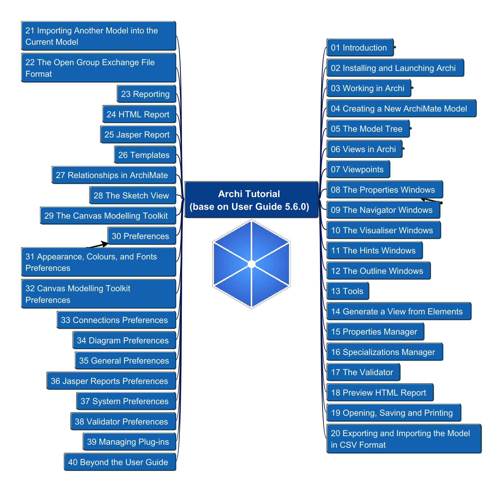

# Archi_Tutorial

This is the repository to document hands-on demos for Archi (ArchiMate Modeling) tool base on "Archi User Guide"

- [Archi\_Tutorial](#archi_tutorial)
  - [Direct Links for Key Archi Resources](#direct-links-for-key-archi-resources)
  - [Structure of the User Guide Content](#structure-of-the-user-guide-content)

## Direct Links for Key Archi Resources

- [Archi Tool Website](https://www.archimatetool.com/)
- [Archi User Guide (5.6.0)](https://www.archimatetool.com/downloads/archi/Archi%20User%20Guide.pdf)
- [Archi Tool Forum](https://forum.archimatetool.com)
- [Archi Project in Github](https://github.com/archimatetool/archi)

## Structure of the User Guide Content

---

Any questions are welcome to reach me at [My Email](mailto:xiaoqizhao@outlook.com?subject=Archi%20Tool%20Tutorial&body=I%20have%20question.)