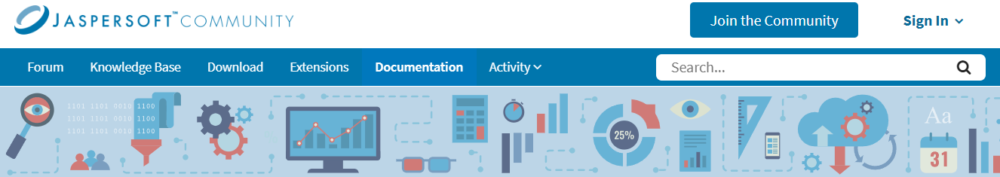

# CH18 Reporting

- [CH18 Reporting](#ch18-reporting)
  - [18.1 HTML Report](#181-html-report)
  - [18.2 Jasper Report](#182-jasper-report)

## 18.1 HTML Report

Reference Material:

- [Archi HTML Report E-R (image)](https://github.com/yasenstar/EA/blob/master/architool/Archi-HTML/ArchiHTML.png)

Watch my YouTube videos for detail:

- [Archi HTML Report 01 - Understand Data Model Structure](https://www.youtube.com/watch?v=_dAQudd3m3c&list=PL6DEHvciXKeUyiBoUZBXu2NcbLrNrMjdk&index=11&pp=gAQBiAQB)
- [Archi HTML Report 02 - Query from Report using AlaSQL (50 minutes)](https://www.youtube.com/watch?v=cYuASoWtFPY&list=PL6DEHvciXKeUyiBoUZBXu2NcbLrNrMjdk&index=10&pp=gAQBiAQB)
- [Archi HTML Report 03 - Analyze Archi Report Data in Power BI](https://www.youtube.com/watch?v=dTwiVNfomCQ&list=PL6DEHvciXKeUyiBoUZBXu2NcbLrNrMjdk&index=9&pp=gAQBiAQB)

Tips:

- [Archi Tip - Create Navigation Page for Views in HTML Report 01](https://www.youtube.com/watch?v=IN5R4R23GBk&list=PL6DEHvciXKeUyiBoUZBXu2NcbLrNrMjdk&index=23&pp=gAQBiAQB)
- [Archi Tip - Create Navigation Page for Views in HTML Report 02](https://www.youtube.com/watch?v=NdtA_xkWSxw&list=PL6DEHvciXKeUyiBoUZBXu2NcbLrNrMjdk&index=22&pp=gAQBiAQB)

Reference Reading:

- [Query Archi HTML Report](https://github.com/yasenstar/EA/blob/master/architool/Archi-HTML/Query-Archi-HTML-Report.md)

## 18.2 Jasper Report

Resource at Jaspersoft Community:

